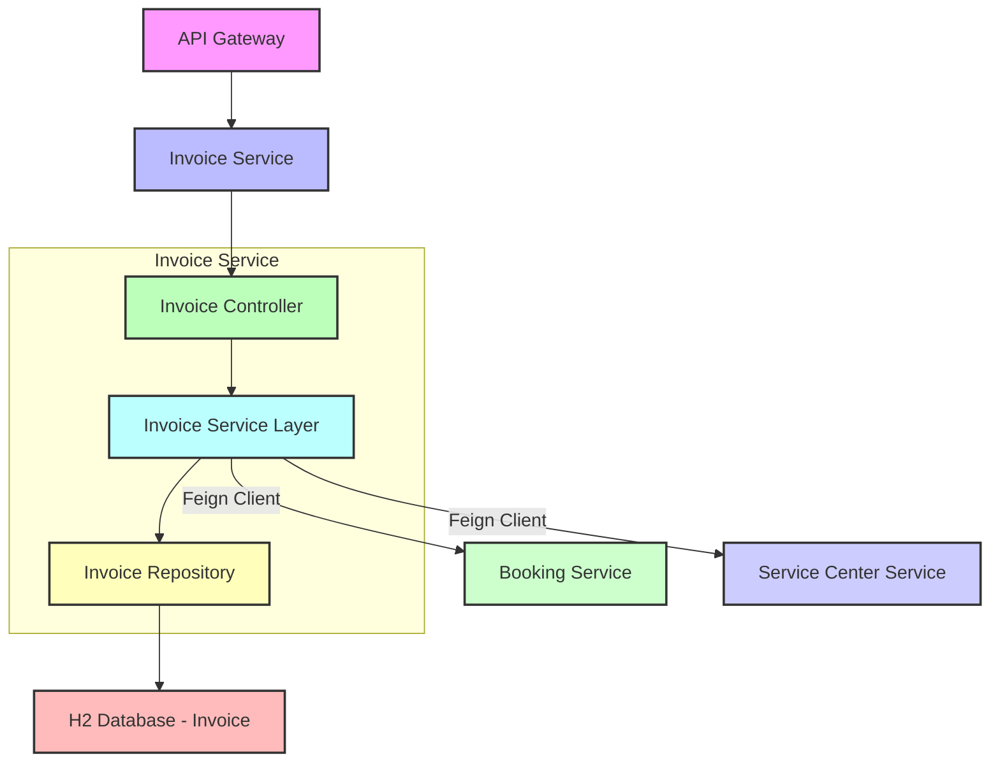
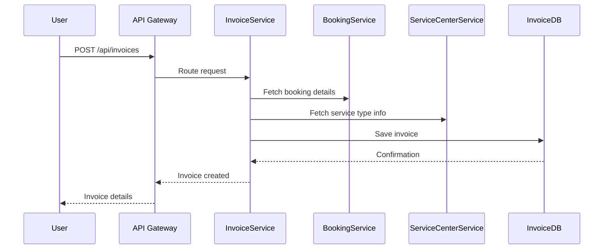

# Invoice and Billing Service

## Table of Contents

- [Overview](#overview)
- [Component Diagram](#component-diagram)
- [Database Table Design](#database-table-design)
- [Endpoints](#endpoints)
- [Key Features](#key-features)
- [Sequence Diagram](#sequence-diagram)
- [Swagger Documentation](#swagger-documentation)
---

## Overview
- **Manages**: Invoices, payment statuses, and invoice downloads.
- **Provides**: RESTful endpoints for invoice generation, retrieval, status updates, and PDF downloads.
- **Communication**: Interacts with the Booking Service and Service Center Management Service via Feign Clients to fetch booking and service type details.
---
## Component Diagram

---

## Key Features
- **Invoice Generation**
    -Automatically create invoices based on bookings and selected service types.

- **Payment Tracking**
    - Update and monitor payment status (e.g., Paid, Pending).

- **PDF Export**
    - Download invoices in PDF format for record-keeping.

- **Service Integration**
    - Full CRUD operations for service centers, mechanics, and service types.

- **Microservice Ready**
    - Designed for scalability and integration in a distributed system.
 ---
 
## Database Table Design

#### Table: `Invoice`

| Field Name       | Data Type     | Description                              |
|------------------|---------------|------------------------------------------|
| `InvoiceID`      | `INT`         | Primary Key, unique identifier           |
| `BookingID`      | `INT`         | Foreign Key referencing `BookingID`      |
| `ServiceTypeID`  | `INT`         | Foreign Key referencing `ServiceTypeID`  |
| `TotalAmount`    | `DECIMAL(10,2)`| Total amount charged                     |
| `PaymentStatus`  | `VARCHAR(20)` | Status of the payment (e.g., Paid)       |

---

## Endpoints

| Method | Endpoint                                 | Description                          |
|--------|------------------------------------------|--------------------------------------|
| POST   | `/api/invoices`                          | Generate invoice for a booking       |
| GET    | `/api/invoices`                          | Get all invoices for a user          |
| GET    | `/api/invoices/{id}`                     | Get invoice details                  |
| PUT    | `/api/invoices/{id}/status`              | Update payment status                |
| GET    | `/api/invoices/{id}/download`            | Download invoice PDF                 |

---

## Sequence Diagram

---

## Swagger Documentation
The Invoice and Billing Service provides interactive API documentation using Swagger.

### Access Swagger UI
Swagger UI for User Service
    - http://localhost:8086/swagger-ui/index.html
