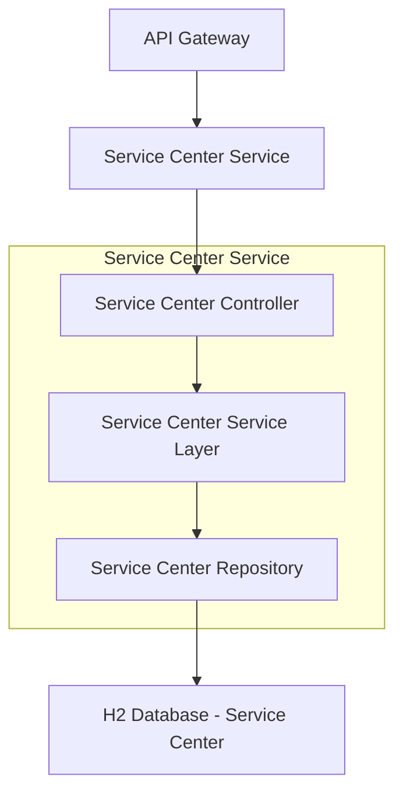
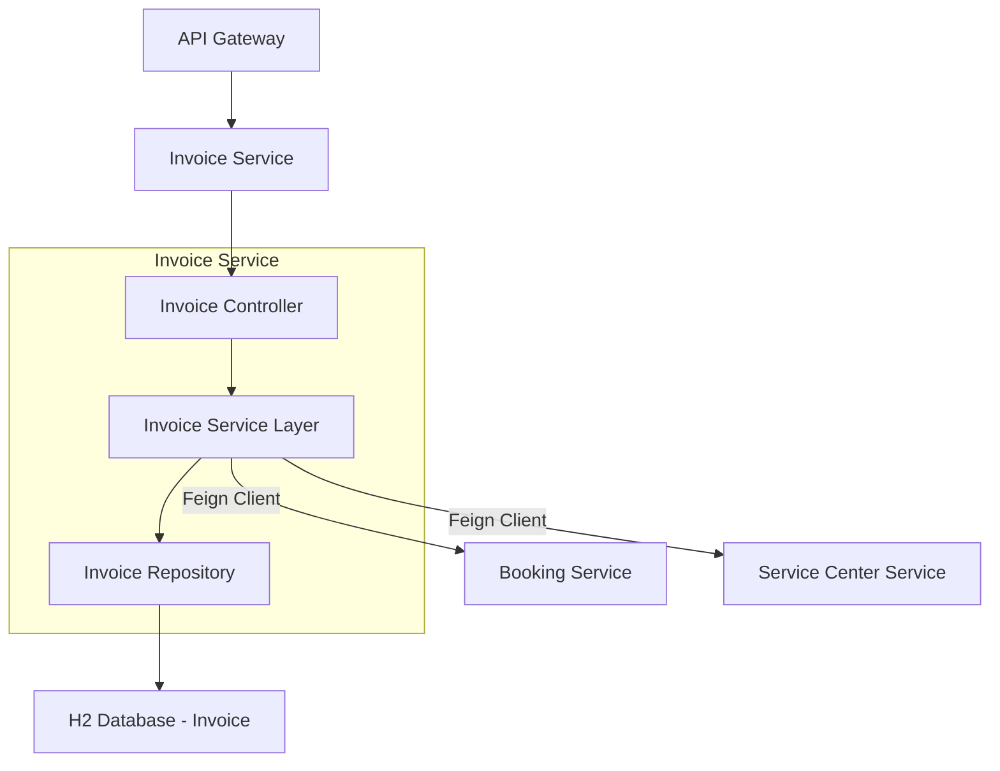
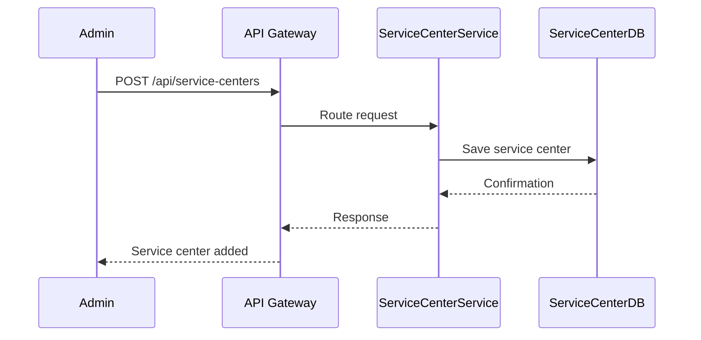
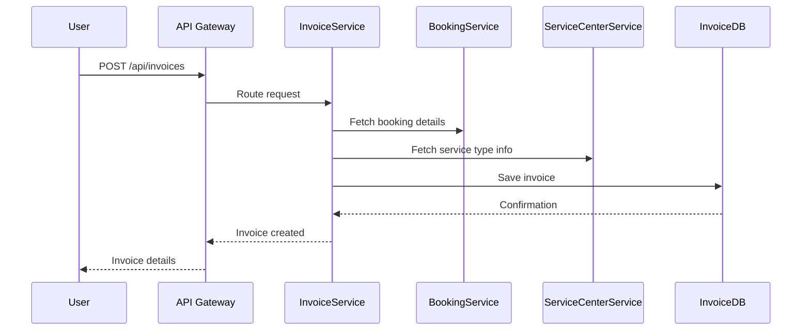

# Vehicle Management System

The Vehicle Management System is a microservices-based application designed to manage users, vehicles, service centers, and billing. It comprises several interconnected services that work together to provide a comprehensive solution for vehicle service booking and management.

---

## Project Overview

This system is built using a microservices architecture, leveraging Spring Boot and Spring Cloud to create a scalable and resilient application. The core functionalities include user registration, vehicle management, service center operations, invoice generation, and payment tracking.

---

## Architecture

The system is composed of the following microservices:

### Service Center Management Service

- **Description**: Manages service centers, mechanics, and service types.
- **Functionality**: Provides RESTful endpoints for CRUD operations on service centers, mechanics, and service types.
- **Communication**: Can be queried by other services (e.g., Invoice Service) to fetch service-related data.

### Service Center Management Service Architecture

### Invoice and Billing Service

- **Description**: Handles invoice generation, payment tracking, and PDF downloads.
- **Functionality**: Links bookings and service types to billing records for accurate invoicing.
- **Communication**: Uses Feign Client to communicate with Service Center Service and other modules.

### Invoice and Billing Service Architecture

### Eureka Discovery Service

- **Description**: Enables dynamic service registration and discovery.
- **Functionality**: Supports scalability and fault tolerance.

### API Gateway

- **Description**: Centralized entry point for all services.
- **Functionality**: Handles routing, authentication, and logging.

---

## Technology Stack

- **Programming Language**: Java  
- **Frameworks**: Spring Boot, Spring Cloud  
- **Database**: H2 (In-memory)  
- **Service Discovery**: Eureka  
- **API Gateway**: Spring Cloud Gateway  
- **Build Tool**: Maven  

---

## Database Table Design

### Service Center Management Service

#### Table: `ServiceCenter`

| Field Name       | Data Type     | Description                              |
|------------------|---------------|------------------------------------------|
| `ServiceCenterID`| `INT`         | Primary Key, unique identifier           |
| `Name`           | `VARCHAR(100)`| Name of the service center               |
| `Location`       | `VARCHAR(255)`| Physical address                         |
| `Contact`        | `VARCHAR(50)` | Contact number or email                  |

#### Table: `Mechanic`

| Field Name       | Data Type     | Description                              |
|------------------|---------------|------------------------------------------|
| `MechanicID`     | `INT`         | Primary Key, unique identifier           |
| `ServiceCenterID`| `INT`         | Foreign Key referencing `ServiceCenterID`|
| `Name`           | `VARCHAR(100)`| Full name of the mechanic                |
| `Expertise`      | `VARCHAR(100)`| Area of specialization                   |

#### Table: `ServiceType`

| Field Name       | Data Type     | Description                              |
|------------------|---------------|------------------------------------------|
| `ServiceTypeID`  | `INT`         | Primary Key, unique identifier           |
| `Description`    | `TEXT`        | Description of the service               |
| `Price`          | `DECIMAL(10,2)`| Cost of the service                      |

---

### Invoice and Billing Service

#### Table: `Invoice`

| Field Name       | Data Type     | Description                              |
|------------------|---------------|------------------------------------------|
| `InvoiceID`      | `INT`         | Primary Key, unique identifier           |
| `BookingID`      | `INT`         | Foreign Key referencing `BookingID`      |
| `ServiceTypeID`  | `INT`         | Foreign Key referencing `ServiceTypeID`  |
| `TotalAmount`    | `DECIMAL(10,2)`| Total amount charged                     |
| `PaymentStatus`  | `VARCHAR(20)` | Status of the payment (e.g., Paid)       |

---

## Endpoints

### Service Center Management Service

| Method | Endpoint                                 | Description                          |
|--------|------------------------------------------|--------------------------------------|
| POST   | `/api/service-centers`                   | Add a new service center             |
| GET    | `/api/service-centers`                   | List all service centers             |
| GET    | `/api/service-centers/{id}`              | Get service center details           |
| POST   | `/api/service-centers/{id}/mechanics`    | Add mechanic to a center             |
| GET    | `/api/service-centers/{id}/mechanics`    | List mechanics in a center           |
| POST   | `/api/service-types`                     | Define a new service type            |
| GET    | `/api/service-types`                     | List all service types               |

### Invoice and Billing Service

| Method | Endpoint                                 | Description                          |
|--------|------------------------------------------|--------------------------------------|
| POST   | `/api/invoices`                          | Generate invoice for a booking       |
| GET    | `/api/invoices`                          | Get all invoices for a user          |
| GET    | `/api/invoices/{id}`                     | Get invoice details                  |
| PUT    | `/api/invoices/{id}/status`              | Update payment status                |
| GET    | `/api/invoices/{id}/download`            | Download invoice PDF                 |

## Sequence Diagrams

### Service Center Management Service

### Invoice and Billing Service

