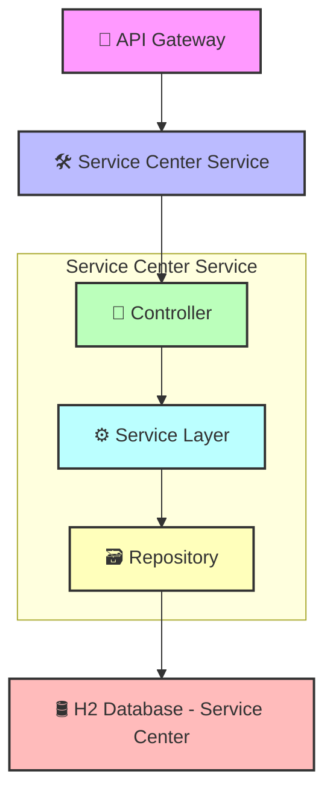
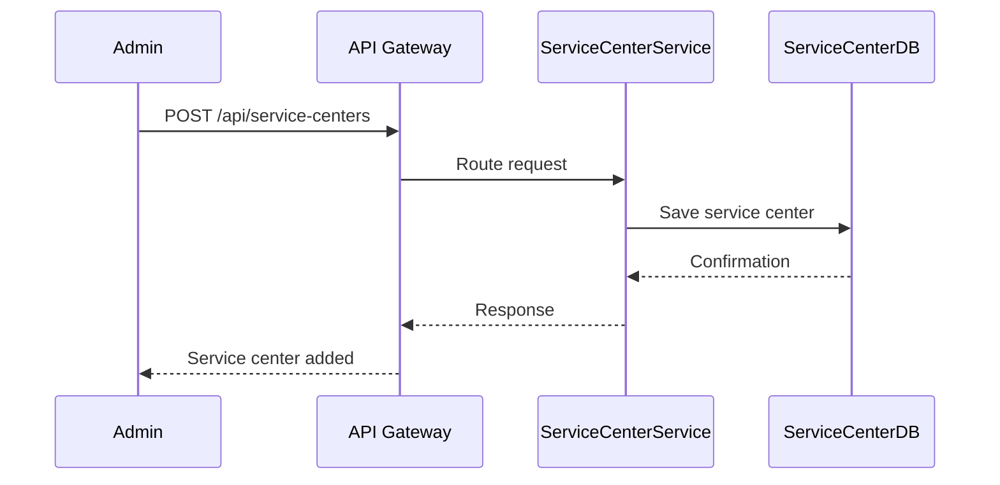

# Service Center Management Service

## Table of Contents

- [Overview](#overview)
- [Component Diagram](#component-diagram)
- [Database Table Design](#database-table-design)
- [Endpoints](#endpoints)
- [Key Features](#key-features)
- [Sequence Diagram](#sequence-diagram)
- [Swagger Documentation](#swagger-documentation)
---

## Overview

- **Manages**: Service centers, mechanics, and service types.
- **Provides**: RESTful endpoints for CRUD operations.
- **Communication**: Can be queried by other services (e.g., Invoice Service).

---

## Component Diagram

---
## Key Features
- **Service Center Registry**
    -Add, view, and manage service center details including location and contact info.

- **Mechanic Management**
    - Assign mechanics to service centers and track their expertise.

- **Service Type Catalog**
    - Define and list various vehicle service types with pricing.

- **RESTful API Support**
    - Full CRUD operations for service centers, mechanics, and service types.

- **Inter-Service Communication**
    - Provides service data to other modules like Invoice Service.

---
## Database Table Design

#### Table: `ServiceCenter`

| Field Name       | Data Type     | Description                              |
|------------------|---------------|------------------------------------------|
| `ServiceCenterID`| `INT`         | Primary Key, unique identifier           |
| `Name`           | `VARCHAR(100)`| Name of the service center               |
| `Location`       | `VARCHAR(255)`| Physical address                         |
| `Contact`        | `VARCHAR(50)` | Contact number or email                  |

#### Table: `Mechanic`

| Field Name       | Data Type     | Description                              |
|------------------|---------------|------------------------------------------|
| `MechanicID`     | `INT`         | Primary Key, unique identifier           |
| `ServiceCenterID`| `INT`         | Foreign Key referencing `ServiceCenterID`|
| `Name`           | `VARCHAR(100)`| Full name of the mechanic                |
| `Expertise`      | `VARCHAR(100)`| Area of specialization                   |

#### Table: `ServiceType`

| Field Name       | Data Type     | Description                              |
|------------------|---------------|------------------------------------------|
| `ServiceTypeID`  | `INT`         | Primary Key, unique identifier           |
| `Description`    | `TEXT`        | Description of the service               |
| `Price`          | `DECIMAL(10,2)`| Cost of the service                      |

---

## Endpoints

| Method | Endpoint                                 | Description                          |
|--------|------------------------------------------|--------------------------------------|
| POST   | `/api/service-centers`                   | Add a new service center             |
| GET    | `/api/service-centers`                   | List all service centers             |
| GET    | `/api/service-centers/{id}`              | Get service center details           |
| POST   | `/api/service-centers/{id}/mechanics`    | Add mechanic to a center             |
| GET    | `/api/service-centers/{id}/mechanics`    | List mechanics in a center           |
| POST   | `/api/service-types`                     | Define a new service type            |
| GET    | `/api/service-types`                     | List all service types               |

---
## Sequence Diagram

---
## Swagger Documentation
The Service Center Management Service provides interactive API documentation using Swagger.

### Access Swagger UI
Swagger UI for User Service
    - http://localhost:8085/swagger-ui/index.html
