## Table of Contents

1. [Service Center Management Service](#service-center-management-service)
2. [Overview](#overview)
3. [Architecture](#architecture)
   - Enhanced Component Diagram
4. [Database Table Design](#database-table-design)
   - Table: ServiceCenter
   - Table: Mechanic
   - Table: ServiceType
5. [Endpoints](#endpoints)
6. [Sequence Diagram](#sequence-diagram)

# Service Center Management Service

- The Service Center Management Service is a core module of the Vehicle Management System. 
- It handles the management of service centers, mechanics, and service types.

---

## Overview

- **Manages**: Service centers, mechanics, and service types.
- **Provides**: RESTful endpoints for CRUD operations.
- **Communication**: Can be queried by other services (e.g., Invoice Service).

---

## Architecture

### Enhanced Component Diagram

```mermaid
graph TD
    style A fill:#f9f,stroke:#333,stroke-width:2px
    style B fill:#bbf,stroke:#333,stroke-width:2px
    style C fill:#bfb,stroke:#333,stroke-width:2px
    style D fill:#bff,stroke:#333,stroke-width:2px
    style E fill:#ffb,stroke:#333,stroke-width:2px
    style F fill:#fbb,stroke:#333,stroke-width:2px

    A[📡 API Gateway] --> B[🛠️ Service Center Service]
    B --> C[📂 Controller]
    C --> D[⚙️ Service Layer]
    D --> E[🗃️ Repository]
    E --> F[🛢️ H2 Database - Service Center]

    subgraph Service Center Service
        C
        D
        E
    end
```

## Database Table Design

#### Table: `ServiceCenter`

| Field Name       | Data Type     | Description                              |
|------------------|---------------|------------------------------------------|
| `ServiceCenterID`| `INT`         | Primary Key, unique identifier           |
| `Name`           | `VARCHAR(100)`| Name of the service center               |
| `Location`       | `VARCHAR(255)`| Physical address                         |
| `Contact`        | `VARCHAR(50)` | Contact number or email                  |

#### Table: `Mechanic`

| Field Name       | Data Type     | Description                              |
|------------------|---------------|------------------------------------------|
| `MechanicID`     | `INT`         | Primary Key, unique identifier           |
| `ServiceCenterID`| `INT`         | Foreign Key referencing `ServiceCenterID`|
| `Name`           | `VARCHAR(100)`| Full name of the mechanic                |
| `Expertise`      | `VARCHAR(100)`| Area of specialization                   |

#### Table: `ServiceType`

| Field Name       | Data Type     | Description                              |
|------------------|---------------|------------------------------------------|
| `ServiceTypeID`  | `INT`         | Primary Key, unique identifier           |
| `Description`    | `TEXT`        | Description of the service               |
| `Price`          | `DECIMAL(10,2)`| Cost of the service                      |

---

## Endpoints

| Method | Endpoint                                 | Description                          |
|--------|------------------------------------------|--------------------------------------|
| POST   | `/api/service-centers`                   | Add a new service center             |
| GET    | `/api/service-centers`                   | List all service centers             |
| GET    | `/api/service-centers/{id}`              | Get service center details           |
| POST   | `/api/service-centers/{id}/mechanics`    | Add mechanic to a center             |
| GET    | `/api/service-centers/{id}/mechanics`    | List mechanics in a center           |
| POST   | `/api/service-types`                     | Define a new service type            |
| GET    | `/api/service-types`                     | List all service types               |

Swagger url - http://localhost:8085/swagger-ui/index.html#/student-controller/createStudent

## Sequence Diagram

